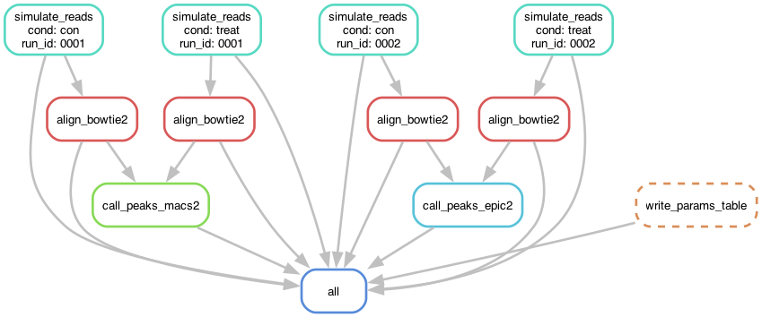

# ChIP-seq Simulation and Benchmarking Framework

> Project Note: This work was originally initiated as a collaborative effort involving three members of the Korf Lab. However, the comprehensive design, implementation, and refinement of the framework presented here are the results of my individual development. The contents of Kenta_Stuff/chipseq_pipeline_v2 represent the primary, up to date workflow and the culmination of my independent research and engineering effort.
> 

## Introduction

Previous research highlights that omitting or under-sequencing control reads results in critical Type I and Type II errors, which compromise peak calling accuracy and study credibility. Despite these risks, many researchers prioritize treatment depth over sufficient control sequencing in ChIP-seq experiments. Current evaluations often use ad hoc, dataset-specific benchmarks that fail to represent the diversity of experimental conditions. This framework addresses the need for a systematic analysis that identifies where peak callers fail within the joint parameter space of treatment and control.

By utilizing a simulation program built on hierarchical modeling of key biases (TF binding, GC content, and chromatin accessibility) and flexible parameterization of over twelve variables (e.g. coverage, peak width), this pipeline enables both truth-aware evaluation (Precision, Recall, and AUPRC) and truth-free metrics (FRiP and p-value distributions). The ultimate goal of this framework is to provide a reproducible resource for stress-testing peak callers, illuminating the conditions under which control sequencing is most critical and guiding best practices for ChIP-seq experimental design.

## Workflow Architecture



The pipeline is orchestrated using Snakemake to provide a modular and reproducible environment for high-performance computing. The workflow manages data flow through the following stages:

- **Simulation (simulation.smk):** This stage generates synthetic paired end reads and a truth file based on a user defined genomic landscape.
- **Alignment (alignment.smk):** Reads are mapped to a reference genome using Bowtie2 or BWA-MEM to evaluate the impact of different alignment strategies on downstream results.
- **Peak Calling (peakcalling.smk):** Standard bioinformatics tools, including MACS2 and EPIC2, are executed to identify regions of enrichment.
- **Evaluation (analysis.smk):** This module compares the called peaks against the known simulation truth to generate performance metrics such as precision and recall. (in progress)

## Modeling

The simulation logic treats the genome as a discrete probability landscape. The framework uses a hierarchical approach to build a Probability Mass Function (PMF) by stacking biological and technical variables. This process is implemented using the NumPy library for efficient vectorized calculations and the SciPy library for statistical distribution modeling.

**Deterministic Bias Construction**
Systematic biases are integrated into the PMF to represent predictable biological signals:

- **Transcription Factor Binding:** Modeled as Gaussian or Laplace signal distributions centered at specific coordinates.
- **GC Bias:** Fragment selection likelihood is adjusted based on experimentally derived GC-content curves.
- **Chromatin Accessibility:** Regions of open chromatin are incorporated as probability multipliers using ATAC-seq data as a reference.

**Stochastic Noise Modeling**
To simulate the inherent variability of wet-lab protocols, such as PCR amplification and antibody efficiency, we introduce over-dispersion. We use the `scipy.stats` library to apply Negative Binomial distributions to the background signal, which provides a more biologically accurate representation of noise than simple Poisson models.

## Project Terminology

To ensure clarity in the context of this framework, specific terms are defined as follows:

- **PMF (Probability Mass Function):** The discrete probability map representing the likelihood of a read fragment originating from a specific genomic coordinate.
- **Planted Truth:** The exact binding sites and coordinates defined during the simulation phase, used as the absolute reference for benchmarking.
- **Deterministic vs. Stochastic:** Deterministic refers to predictable biological signals (e.g. TF peaks), whereas stochastic refers to random experimental noise modeled through statistical variance.

## Technical Implementation

The repository is structured to maintain a clear separation between core logic, configuration, and workflow orchestration.

Bash

```.
├── config.yaml             # Study parameters (coverage, TF enrich, etc.) for the parameter sweep
├── Snakefile.py            # Main Snakefile
├── data/                   # Input genomes, accessibility tracks, and bias profiles
│   ├── accessibility/      # BED files for euchromatin regions
│   ├── gc_bias/            # Experimentally derived GC curves (CSV)
│   ├── genomes/            # Reference FASTA and chromosome size files
│   └── indexes/            # Pre-built Bowtie2 and BWA-MEM indices
├── envs/                   # Conda/Mamba environment definitions (sim, align, peak)
├── results/                # Final parameters and PMF variance outputs
├── rules/                  # Modular Snakemake components (simulation, alignment, peakcalling)
├── scripts/                # Core Python ChIP-seq simulation (updated_chip_seq.py)
├── temp/                   # Intermediate FASTA and PMF files for treatment and control
├── tests/                  # Unit tests
└── AGENTS.md
```

## Reproducibility and Usage

This project utilizes Conda and Mamba for dependency management, ensuring that all scientific libraries and bioinformatics tools are version controlled and reproducible.

**Installation**

Bash

```
# Clone the repository
git clone <repo_url>
cd Kenta_Stuff/chipseq_pipeline
```

**Execution**
The following command is an example of how to execute the pipeline for a parameter sweep defined in the configuration:

Bash

```
snakemake -s Snakefile.py \
  --configfile config.yaml \
  --use-conda \
  --cores 6 \
  --keep-going \
  --rerun-incomplete
```

## Future Directions

- **Resource Management Optimization:** Establishing resource estimation and allocation protocols when dealing with large parameter sweeps with large combinatorics to ensure efficient HPC utilization.
- **Automated Performance Evaluation:** Completing the downstream analysis module to systematically evaluate peakcaller performance. This involves calculating metrics like Precision, Recall, and Area Under the Precision-Recall (PR) Curve against the Planted Truth, alongside truth-free measures such as Fraction of Reads in Peaks (FRiP) and p-value distribution analysis. This effort also includes assessing spatial precision by measuring the distance between identified summits and simulated binding centers.
